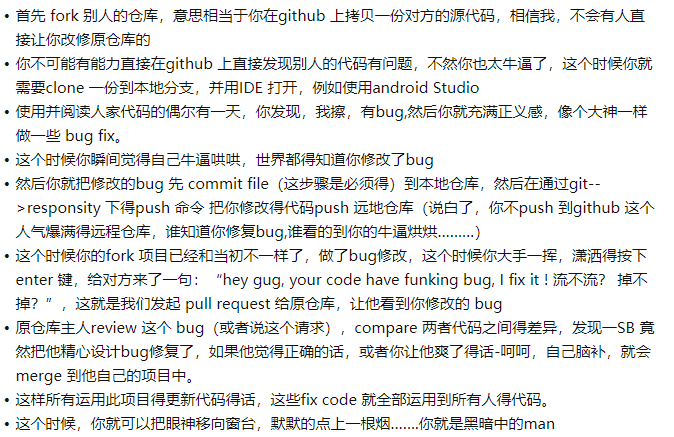

# 如何利用github进行多人协作开发

XDM，我又来了，最近的产出，比平时要多那么一点，目的很明确，就想找个开源项目，加入开源的团队，提升自己，从小白变成个伪大佬是今年的目标，可以的话成为真大佬那就再好不过了哈哈。话题扯的比较远，结合各种大佬说的各种开源项目的各种流程，在加上自己不怎么样的悟性，打算产出这篇文章，希望大佬可以指正萌新的错误，萌新和我一起努力前进！

## 知乎大佬的一张图

先来个知乎大佬的一张图，我看完是笑死了，但还是有点意思的

虽然我不抽烟，但还是想做黑暗中的man啊，so cool

## 先聊聊上家公司git flow

在我上家公司，用的`git flow`, 每次新功能就是在dev上拉个feature分支，开发完，开发环境前后端联调ok后，发起merge request会有团队成员review，review通过后就merge到develop分支，等所有团队开发的feature都review通过合进develop后，开发环境也都ok没问题了（给测试前开发肯定要验自己开发的功能），就基于develop拉release分支，然后进行测试，测出bug，团队成员都是在release上改bug，测试过了后，测试报告也出了后，就把release分支合进develop，最终上线都是develop合进master，如果有线上bug，热修复就是在master上拉hotfix热更新，差不多就这样

接下去可以对比下github flow

## 自己悟的流程

1. 先fork项目，找到自己想要加入的开源项目，这个肯定没有问题吧，这样我们自己的仓库下就有了该开源项目
2. `git clone`该项目，`master`分支也可以，而且clone下来你可以切换其他的分支，随意调戏，我当初学习vue的源码其实也是这样的，看源码，不把项目clone下来在自己的本地环境里运行是不完整的，何况现在想加入开源项目学习贡献代码，怎么可能不clone
3. git配置下自己的github账号邮箱，为了让别人看到是谁提交的，装逼，一统逼界不就是为了这个嘛（手动滑稽）
4. 每个开源团队的开发流程规范可能都不一样，相信我，想要贡献代码，一定要建立自己的分支，一般应该是在最新的develop上拉取分支，如果是新功能，估计应该也是`feature-xxx`开头，其他的命名规范应该跟着团队的要求走
5. 接下去就是开发了，编码规范可以弄eslint，注释规范跟团队要求，比如jsdoc，然后要出单元测试，这个涉及到测试覆盖率，程序稳定性，自己开发好的东西不能把之前的功能搞炸吧，自己的功能自己也要测试，最后就要看是否要更新各种文档，比如开发文档是否要记录，是否要更新用户文档
6. 提交代码，这个也有对应的规范，至少自己写的代码做的是什么功能什么事，提交的commit要与之匹配，如果之前有多次提交的话，可以用`rebase`合并，可以看下我在掘金的这篇文章[git rebase学习心路旅程](https://juejin.cn/post/6923061094546145294)
7. 提交好代码后，当然测试环境测试代码，记得有`github actions`可以自动部署到测试环境，这个我还没仔细研究过，日后有机会研究下，在产出文章和XDM一起学习
8. 开发好了测试也ok了，那就要PR了
    * 首先要明确，我们的feature-xxx是基于dev拉取的
    * 所以pr的时候应该是选中开源项目develop分支，以及我们自己项目的feature分支进行对比，这个时候可以看Files Changed，符合预期就确定创建PR，不符合就关掉修改代码后再次提交PR
    * 如果提示dev分支有冲突，本地先获取最新的dev分支
    * 在feature-xxx执行`git rebase dev`，可以继续看下我的这篇文章[git rebase学习心路旅程](https://juejin.cn/post/6923061094546145294)
    * rebase后当然重新push
    * 然后重复上述步骤，直到没有冲突符合自己预期，那就确认创建pr
9. 然后就有大佬帮你review代码了，各种讨论审核是否修改，改完继续重复pr的过程
10. 当我们通过了管理者的考验，我们的代码合进开源团队的项目的时候，那么我们就成功贡献了我们的代码，那就成为夜空中最亮的星了。

