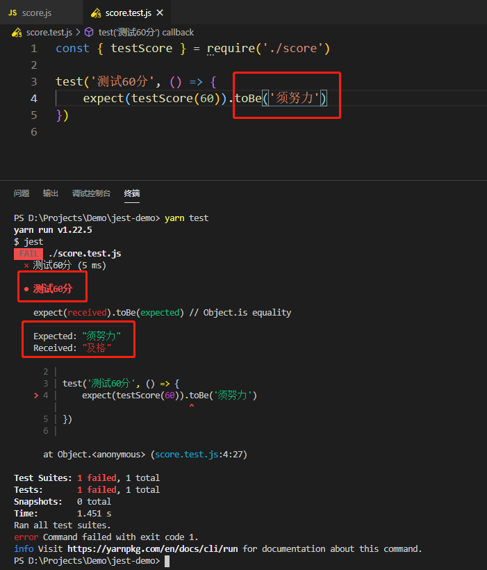
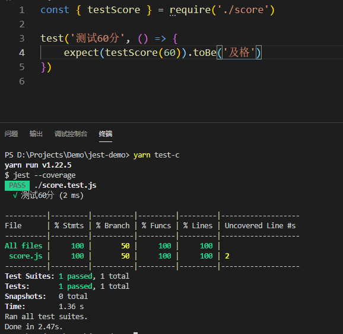
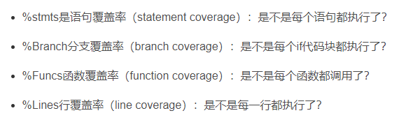
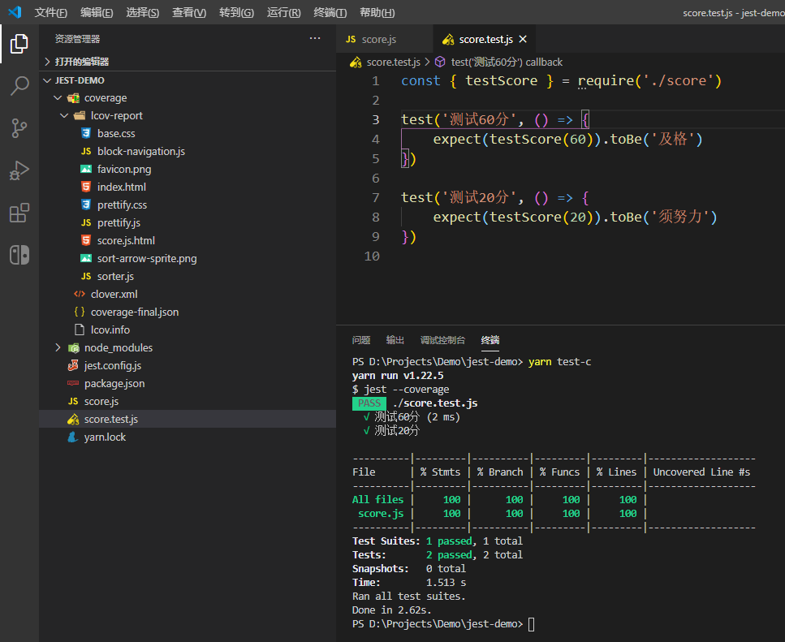
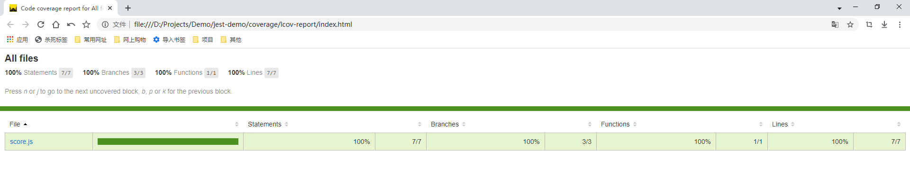
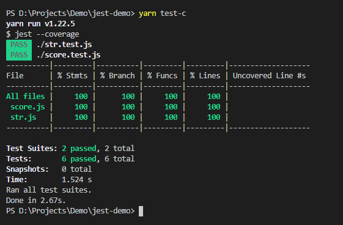
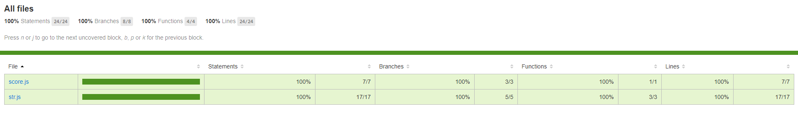

# Jest初体验

## [测试规范](https://github.com/wangeditor-team/wangEditor/blob/master/docs/test.md)

大家好，我是梅利奥猪猪，前端工程化之测试环节，是我曾经没有接触过的领域，只有简单了解，看了团队的测试规范，感慨果然要学的东西很多，以下是我做的简单的关于测试的一些概念专业术语的笔记

* 单元测试 （本次学习以jest为主，作为萌新的我，带着各种和我差不多的萌新一起写个hello world的案例）
    - 站在程序员的角度测试
    - unit测试是把代码看成是一个个的组件。从而实现每一个组件的单独测试，测试内容主要是组件内每一个函数的返回结果是不是和期望值一样。
    - 技术栈：jest 

* E2E测试 （后续在有时间在补充）
    - 站在用户角度的测试
    - e2e或者端到端（end-to-end）或者UI测试是一种测试方法，我不懂你内部是怎么实现的，它用来测试一个应用从头到尾的流程是否和设计时候所想的一样。我只负责打开浏览器，把测试内容在页面上输入一遍，看是不是我想要得到的结果。简而言之，它从一个用户的角度出发，认为整个系统都是一个黑箱，只有UI会暴露给用户
    - 技术栈：Cypress

* 两者的存在都是很有意义的。
    - unit测试是程序员写好自己的逻辑后可以很容易的测试自己的逻辑返回的是不是都正确。
    - e2e代码是测试所有的需求是不是都可以正确的完成，而且最终要的是在代码重构，js改动很多之后，需要对需求进行测试的时候测试代码是不需要改变的，你也不用担心在重构后不能达到客户的需求。  

接下来我们就开始简单玩耍Jest吧

## 开始学习

### 搭建环境

新建文件夹jest-demo，`yarn init -y`初始化package.json，`yarn add jest -D`安装jest依赖，`npx jest --init`生成初始化文件，这就是我们简单搭建的环境，关于`npx jest --init`我选择的每一项是这样的

* 是否要在package.json中生成test命令 - 选择是，所以我们看到了scripts多了**test**命令，之后只要`yarn test`就可以了，这里先简单提下我的理解，应该是只要是**xxx.test.js**就会运行
* 是否配置文件用ts - 这里选择了否，先用js试试水
* 选择测试环境 - 我们没有选择node，选择`browser-like`类似浏览器环境
* 测试覆盖率报告 - 选择是，玩玩看不香嘛，看下自己测试覆盖率是否百分百，这边我们可以手动在`package.json`里添加测试覆盖率的执行命令`"test-c": "jest --coverage"`
* 后面2个配置选项理解不深就先不误人子弟，选择了默认的，后续懂了再来补充

### 开始编码

直接在根目录下新建`score.js`，代码我们就写简单点，考试60分以上（包括60）就及格，低于60分就不及格
```js
function testScore (score) {
    return score >= 60 ? '及格' : '须努力'
}

module.exports = {
    testScore,
}
```

开始写测试用例，也是在根目录下新建`score.test.js`，对，就比之前的文件多个`.test`
```js
const { testScore } = require('./score')

test('测试60分', () => {
    expect(testScore(60)).toBe('及格')
})
```


第一行require的代码我就不多说了，这里主要讲解下jest最基本的语法，test函数第一个参数就是个字符串，用于描述我们测试的内容，第二个参数是个回调函数，具体的逻辑就在里面写，expect见名知意就是我们期待是什么结果，这里我们调用了`testScore(60)`明显就是及格嘛，然后紧接着是`toBe`这个语法是匹配器，据考察应该相当于`===`，后续还有各种匹配器，我们先玩最简单的`toBe`，然后就是我们期望的结果是什么，即是否与我们写的逻辑函数返回值一致，我们写上`'及格'`这个测试肯定是没问题的，紧接着我们就可以跑下单元测试了`yarn test`


牛逼，和我们预计的一样，我们故意把`toBe`的参数改错再看下



哭哭唧唧，出错了，但和我们预期的是一样的，报错信息也很完整接着我们在改回一开始正确的及格，然后跑下`yarn test-c`测试覆盖率看下



卧槽，看不懂，面向百度下



原来是我们的if分支没有覆盖全，还有没有覆盖的lines，主要因为我们没有测试不及格的情况，那就安排下，加上不及格的测试方法，之后再看下覆盖率
```js
test('测试20分', () => {
    expect(testScore(20)).toBe('须努力')
})
```



这次就牛逼了，全部覆盖了，对了，有时候可能我们的领导们要看我们的测试覆盖率，那不可能直接把我们的终端截图给他们看，其实jest帮我们生成了coverage的文件夹，可以找到对应的页面打开，路径在`coverage\lcov-report`下的`index.html`，打开看下，还是挺酷炫的，因为我们现在就测试了一个模块（score.js），所以只有表格中只有一行，所以当项目的测试文件后续越来越多，测试覆盖率的报告也能体现出来



## 自己想的题练习，给和我差不多萌新的XDM一起做题加强练习一波

了解了基础知识后，好记性不如烂笔头，在做个类似的，给大家出题，然后自己再写个单元测试全覆盖

* 新建个模块，关于字符串相关方法    
    * 实现去除所有空格的方法
    * 实现字符串反转方法
    * （附加题）实现compose函数，混合之前的方法，导出全新方法(removeAllSpaceAndReverse)

* 测试相关代码
    * 测试去除所有空格是否实现
    * 测试字符串反转方法是否实现
    * 测试先去除所有空格再反转字符串的结果和先反转字符串再去除所有空格结果是否一致  
    * （附加题）测试removeAllSpaceAndReverse  

## 公布答案    

* str.js代码如下
```js
function removeAllSpace (str) {
    return str.replace(/\s/g, '')
}

function reverseStr (str) {
    return str.split('').reverse().join('')
}

const compose = (...fns) => str => fns.reduce((current, fn) => fn(current), str)

const removeAllSpaceAndReverse = compose(removeAllSpace, reverseStr)

module.exports = {
    removeAllSpace,
    reverseStr,
    removeAllSpaceAndReverse
}
```

* str.test.js代码如下
```js
const {
    removeAllSpace,
    reverseStr,
    removeAllSpaceAndReverse
} = require('./str')

test('测试去除所有空格-  a  b  c  ', () => {
    expect(removeAllSpace('  a  b  c  ')).toBe('abc')
})

test('测试字符串反转-abc', () => {
    expect(reverseStr('abc')).toBe('cba')
})

test('测试先去除所有空格再反转字符串的结果和先反转字符串再去除所有空格结果是否一致', () => {
    expect(reverseStr(removeAllSpace('  a  b  c  '))).toBe(removeAllSpace(reverseStr('  a  b  c  ')))
})

test('测试混合函数是否能即去除所有空格又反转字符串-removeAllSpaceAndReverse', () => {
    expect(removeAllSpaceAndReverse('  a  b  c  ')).toBe('cba')
})
```

* 终端的截图如下



我们有2个单元测试分别是score和str，6个测试案例(score有2个str有4个)，并且全部覆盖

* 网页看覆盖率



### compose不能理解的过来看下

不知道大家有没有看过redux的源码，其中就有compose的思想
```ts
export default function compose(...funcs: Function[]) {
  if (funcs.length === 0) {
    // infer the argument type so it is usable in inference down the line
    return <T>(arg: T) => arg
  }

  if (funcs.length === 1) {
    return funcs[0]
  }

  return funcs.reduce((a, b) => (...args: any) => a(b(...args)))
}
```
这里其实是对中间件进行了处理，写的非常的巧妙，然后我们这里的例子其实是差不多的，假象我们有对字符串操作有a,b,c三个方法，然后又恰巧有需求，这3个方法都要作用于在这个字符串上，虽然`a(b(c(str)))`或者`c(b(a(str)))`都可以实现，但如果有更多的方法是不是这代码看上去就非常不舒服了，这个时候我们就可以使用compose，高阶函数的思想，返回个全新的函数使用，接下来我慢慢讲解下
```js
const compose = (...fns) => str => fns.reduce((current, fn) => fn(current), str)
```
首先我们会接受若干个函数混合，所以一开始的`...fns`就是拿到这若干个函数，其次我们这里的高阶函数就是要返回一个函数，这个新的函数就是我们要使用的，接受一个字符串，然后再去写里面的逻辑，拆开的步骤应该就是这样的
```js
const compose = (...fns) => (str => 里面的逻辑) //(str => 里面的逻辑) 把这个看做整体，即返回值是个函数
```
接下去我们就要对函数一步一步的操作了，前一个函数的返回值，给下个函数作为结果接受，用reduce贼香，这个时候又要考验大家对reduce的理解，可以接受2个参数，第一个是我们自己处理的函数，第二个是初始值，这里必须传str，如果不传默认是数组的第一项，也就是我们传的第一个函数，所以最后就变成了这样的成品，并且测试通过美滋滋
```js
const compose = (...fns) => str => fns.reduce((current, fn) => fn(current), str)
```

## 总结

又水了一篇文章，这次是jest的hello world版，希望大家喜欢！（持续变强中，等大佬带飞）


