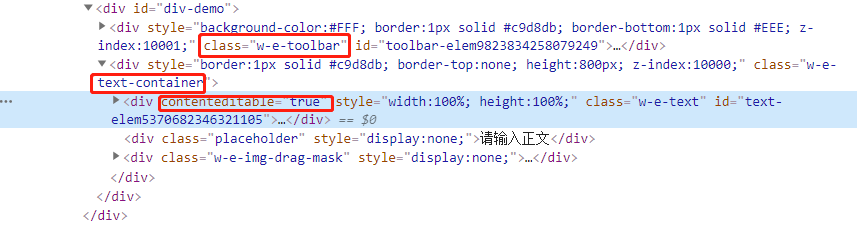
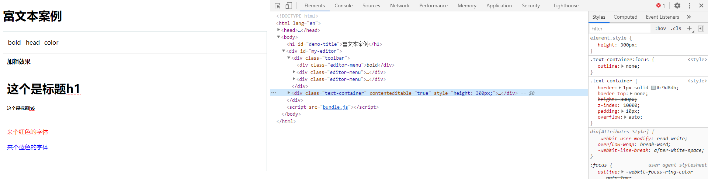

# 从零开始写的简单富文本(webpack + ts)

## 背景

“下个版本我们文字转语音项目需要做多音字功能，类似‘我爱音乐，我很快乐’，让音乐的乐发音为le，让快乐的乐发音为yue，在文本框里点击对应多音字，可以选择对应的发音，并且给出特定的样式，研发可以空余时间调研下该功能”，经调研，node的“pinyin”可以完成点击多音字展示不同音标，接下来就是点击音标后在字后面显示特殊的样式的音标标记！但我们现在的功能用的是textarea啊，纯文本域还能改变文字的样式嘛！（调研蓄力中，蓄力完成），这必然要用到富文本了啊，可市面上的富文本这么多，到底选哪个呢，最后一款wangEditor富文本编辑器映入我的眼帘，不管是它的文档，还是各种demo，(codepen上能看，源码中的examples也能看，真香)，决定就是你了~

## 动机

文档真详细，写的真好，在文档buff的加持下，调研demo很快就完成了~~巧就是这么巧，期间我看到了文档中贡献代码，加入团队，开发人员等字样，在加上之前在寻找使用哪款富文本编辑器时，看到了这么句话“争做国内使用体验Z好的开源 Web 富文本编辑器！”,老夫的开源的梦就被点燃了，以前空了只是会下载些开源项目的源码看看，简单了解下实现的思路，然后就当一条咸鱼，不了了之了。那既然想要加入开源团队，那至少要对富文本实现的原理有所了解吧，于是这个项目就诞生了，纯粹实现些简单的功能，正好之前自学过一点ts的知识，用`webpack + ts`简单的实现下**加粗**，**设置标题**，**设置颜色**吧

## 开发咯

### 搭建webpack+ts

* 咳咳，作为一个优秀的文档cv搬运工，打开webpack官网，一阵cv猛如虎，ts-loader，热更新，html-webpack-plugin, sass-loader等，全部搞好，项目简单搭建就完成了，这里就不详细记录搭建项目的过程了~

### 简单调研wangEditor && 实现

* 作为萌新菜如狗的我，调研方向其实很简单，就这么几个
    * 打开官方文档，最基本的使用，看到以下代码
        ```js
        const E = window.wangEditor
        const editor = new E('#div1')
        editor.create()
        ```
    * 打开官网的实际demo案例，f12审查元素
    * 核心API为`document.execCommand`，这里贴上[mdn的文档](https://developer.mozilla.org/zh-CN/docs/Web/API/Document/execCommand)

* 根据最基本的使用文档，要实现功能，用面向对象的思想，声明类`class Editor`，然后实现核心的create方法，当中肯定包含了各种渲染页面元素啦（包括菜单，用户实际编写的区域），监听事件，实现我们初步定下的3个功能（加粗，设置标题，设置颜色），这里要注意的是，实际编写的区域是个div，加上属性(contenteditable)，至于我怎么知道的，因为我调研努力呀~(手动滑稽，其实是因为下方f12审查元素发现的真相)
* 根据f12审查的元素，发现了真相
    * 先看截图，截图如下

        

    * 发现构造函数传入的选择器字符串(文档中后面发现还可以传入元素)，实际上就是我们最外层包裹的div元素，然后div里还有这么2个div，分别是`toolbar`和`text-container`两部分
    * toolbar就是我们实际的菜单了，这边肯定是用数组的，因为我们在官方文档中配置菜单可以看到这个代码
        ```js
        // 配置菜单栏，删减菜单，调整顺序
        editor.config.menus = [
            'bold',
            'head',
            'link',
            'italic',
            'underline'
        ]
        ```
    * 有些菜单有子菜单，比如标题啊字体颜色啊，但最后点击后触发效果，底层的原理就是调用了`document.execCommand`，这里我开发中还遇到了些问题，会放在最后文章最后遇到的难点里在详细和大家说    
    * text-container的行内样式style，我们发现了height的属性，这肯定就是我们一开始配置项设置的高度（实际后面开发的时候忘记了- -所以没有在text-container中包住实际用户编辑区域的那个div，我写的demo就一个toolbar和直接一个contenteditable为true的div）
    * 在text-container里面的div，很明显就是我们的编辑区域了，我们看到了`contenteditable`属性 

* 关于核心API`document.execCommand`       
    * 函数签名，实际传入参数有三个，第二个参数貌似常年为`false`，所以可以简单封装个函数，方便我们使用，即第二个参数我们写死为`false`，直接传入2个参数即可
    * 加粗功能 - 可以找到对应的commandName为`bold` 
    * 字体颜色功能 - 可以找到对应的commandName为`foreColor`
    * 设置标题功能 - 真的难到我了，没有找到合适的，我就用`insertHTML`实现,因为想到的是h1~h6标签，我使用这个命令组装下对应的html元素就改成标题了吧，事实上的确可以这么做，如果有设置标题对应的commandName，希望大佬轻喷，指导下小弟

### 遇到的难点

* 调用execCommand竟然无效，什么情况，说不出的苦
* 后面发现是选中的区域不见了，所以需要保存之前选中的区域，然后点击功能前恢复选中的区域
    * 这边用了比较挫的方式，在移入菜单的时候保存选中区域
    * 点击菜单触发api前恢复选中区域
    * 核心的代码就是selection和range
        ```js
        // 以下代码是获取范围
        selection = window.getSelection()
        range = selection && selection.getRangeAt(0);
        // 以下代码是重新设置范围
        selection.removeAllRanges()
        selection.addRange(range);
        ```
* 然后就完成了这个比较劣质的富文本小案例，如下效果

    

* **我又要来补充遇到的难点了**，咳咳，输入一行文字，选中个范围，刁钻的点下编辑器外部，在点击加粗，我的加粗呢！！
* 所以在失去焦点的时候我们需要保存range，这样就能修复这个bug了，核心的写法如下
    ```js
    this.editor.textContainerEl.addEventListener('blur', () => {
      range = document.getSelection().getRangeAt(0).cloneRange();
    })
    ```    

### 彩蛋

* 其实有很多细节还没有处理好，后续有机会在慢慢完善
* 富文本还是特别好玩的，就拿api中的`window.getSelection()`来说，发现了光标的一些细节
    * 选中同一段文本，可能因为选取方向不一样有anchorOffset，extentOffset的区别
    * 举例说明比如选中`1234`文本，你光标从左边的1选到右边的4和从右边的4选到左边的1是不一样的吧
    * 虽然选择区域都是1234，锚点的位置是固定的，即你鼠标点下去的位置，然后你的拖动的位置是不固定的，所以focus的位置是用户选中到哪决定的
* 总体来说这次调研加完成这个小项目还是有不少收获的
* 最后希望大佬轻喷，项目的确有不少问题，希望大佬指导带飞，萌新和萌新的我组队一起学习变强~    


