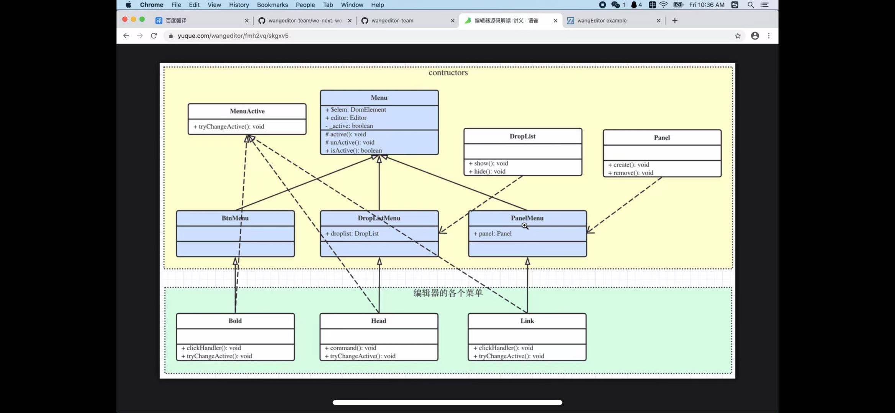
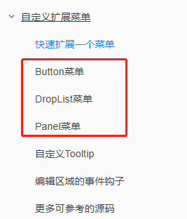
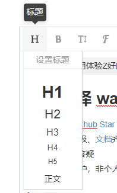
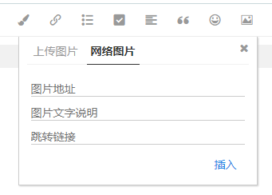

# TS类与接口 之 结合看wangEditor大佬架构学习

## 废话不多说，先看架构图



## 还是来点废话吗（各位看官求不要打我，先别关，还是有点干货的）

大家好，这里是梅利奥猪猪，经过这几天的学习产出，功夫不负有心人，总算通过了开源团队老大的考核(大家有兴趣也可以来加入哈，直接官方[文档](https://doc.wangeditor.com/)里加群，老大会对你考核的)，有机会成为开源团队wangEditor的成员，有了变强的途径，哈哈所以和大家来分享我的喜悦。但是加入团队前，很多知识我都不熟悉，比如ts(实际工作中都没有用，都是自己平时XJB搞着玩)，自动化测试(jest等，也都是自己XJB搞着玩)，团队的文档很严谨很详细，老大要我加入前先要熟悉各种[规范](https://github.com/qianfengg/wangEditor/tree/master/docs)(包括源码结构，开发规范，测试规范等)，所以对于源码结构这块，我看了会menu相关的代码(架构如开头的图这样)，所以这篇文章出生了

## Menu架构分析

### 分析前先要了解我们产品的Menu

先看文档总没错的，来张文档的截图



Button是什么，DropList什么鬼，Panel嗯？？

来来来听我娓娓道来，你们立马就懂，分别举几个例子

* 加粗功能 - 是不是点下按钮，就直接触发效果了，选中的字蹭的一下就加粗了(这里就不展示图片了毕竟点一下就触发功能了) - BtnMenu

* 标题功能 - 鼠标移上去出现了下拉菜单，有h1~h6，鼠标移开后菜单消失 - DropListMenu



* 插入图片 - 点击后弹出了个框，然后用户就可以傻瓜式操作啦 - PanelMenu



到这里，我们就知道了wangEditor产品，菜单目前一共就3种类型，简单易懂~

### 先简单说说类的继承吧

通过架构图，我们可以清楚的看到，所有的菜单类，都会继承这3种父类型的菜单，简单的说就是

* 加粗菜单 - 继承BtnMenu
* 标题菜单 - 继承DropListMenu
* 插入图片菜单 - 继承PanelMenu

然后这3类菜单又会继承最大的父类Menu

### 再简单说说接口吧

接口就是一种规范，我们发现架构图里有这么几个接口

* MenuActive - implements后必须要实现方法**tryChangeActive**
    * 这个方法其实就是激活菜单的，比如你富文本中有加粗的字体和没有加粗的字体，当你点击光标在没加粗的字体的时候，加粗的菜单不会高亮，但你点到加粗的字体的时候，菜单就要高亮，所以对于每个菜单来说都必须`implements MenuActive`， 且`tryChangeActive`方法名见名知意，大佬架构牛逼！
* DropList - implements后必须要实现方法**show**和**hide**
    * 下拉菜单的展示和隐藏很好理解，所以DropListMenu会去实现DropList接口，大佬架构牛逼！
* Pannel - implements后必须要实现**create**和**remove**
    * 创建pannel和移除pannel简单易懂，所以PanelMenu会去实现Panel接口，大佬架构牛逼！

### 还有很多细节没说，先来随便贴一个源码给大家一起看看，分析源码啦

先来看看最大父类，源码如下
```ts
/**
 * @description Menu class 父类
 * @author wangfupeng
 */

import { DomElement } from '../../utils/dom-core'
import Editor from '../../editor/index'
import Panel from './Panel'

export interface MenuActive {
    /**
     * 修改菜单激活状态，菜单是否高亮
     */
    tryChangeActive(): void
}

class Menu {
    public key: string | undefined
    public $elem: DomElement
    public editor: Editor
    private _active: boolean // 菜单是否处于激活状态，如选中一段加粗文字时，bold 菜单要被激活（即高亮显示）

    constructor($elem: DomElement, editor: Editor) {
        this.$elem = $elem
        this.editor = editor
        this._active = false

        // 绑定菜单点击事件
        $elem.on('click', (e: Event) => {
            Panel.hideCurAllPanels() // 隐藏当前的所有 Panel

            // 触发菜单点击的钩子
            editor.txt.eventHooks.menuClickEvents.forEach(fn => fn())

            e.stopPropagation()
            if (editor.selection.getRange() == null) {
                return
            }
            this.clickHandler(e)
        })
    }

    /**
     * 菜单点击事件，子类可重写
     * @param e event
     */
    protected clickHandler(e: Event): void {}

    /**
     * 激活菜单，高亮显示
     */
    protected active(): void {
        this._active = true
        this.$elem.addClass('w-e-active')
    }

    /**
     * 取消激活，不再高亮显示
     */
    protected unActive(): void {
        this._active = false
        this.$elem.removeClass('w-e-active')
    }

    /**
     * 是否处于激活状态
     */
    public get isActive() {
        return this._active
    }
}

export default Menu
```

注释详细到，我感觉都不用我讲解了, 具体解释放到孙子类加粗菜单

加粗菜单的源码如下

```ts
/**
 * @description 加粗
 * @author wangfupeng
 */

import BtnMenu from '../menu-constructors/BtnMenu'
import $ from '../../utils/dom-core'
import Editor from '../../editor/index'
import { MenuActive } from '../menu-constructors/Menu'

class Bold extends BtnMenu implements MenuActive {
    constructor(editor: Editor) {
        const $elem = $(
            `<div class="w-e-menu" data-title="加粗">
                <i class="w-e-icon-bold"></i>
            </div>`
        )
        super($elem, editor)
    }

    /**
     * 点击事件
     */
    public clickHandler(): void {
        const editor = this.editor
        const isSelectEmpty = editor.selection.isSelectionEmpty()

        if (isSelectEmpty) {
            // 选区范围是空的，插入并选中一个“空白”
            editor.selection.createEmptyRange()
        }

        // 执行 bold 命令
        editor.cmd.do('bold')

        if (isSelectEmpty) {
            // 需要将选区范围折叠起来
            editor.selection.collapseRange()
            editor.selection.restoreSelection()
        }
    }

    /**
     * 尝试修改菜单激活状态
     */
    public tryChangeActive(): void {
        const editor = this.editor
        if (editor.cmd.queryCommandState('bold')) {
            this.active()
        } else {
            this.unActive()
        }
    }
}

export default Bold
```

吐槽: 曾几何时，觉得加入开源团队，帮忙写写注释也是贡献，然后老大说的正式军果然厉害，注释这么详细完美，都不给机会。哈哈，看来要做更有价值的贡献者，废话不多说，分析源码啦
* 导入import相关，不解释了，不清楚的小伙伴打屁屁
* 来看源码这行`class Bold extends BtnMenu implements MenuActive`，继承BtnMenu，实现MenuActive
* 构造函数的代码，不就定义的加粗的dom元素，因为继承了BtnMenu，需要调用super
```ts
constructor(editor: Editor) {
    const $elem = $(
        `<div class="w-e-menu" data-title="加粗">
            <i class="w-e-icon-bold"></i>
        </div>`
    )
    super($elem, editor)
}
```
* 点击事件源码注释太详细了，就是点击后要做的事，子类重写父类的方法`clickHandler`
* 实现tryChangeActive，`queryCommandState`看状态，有这个状态激活没这个状态不激活，可能有小伙伴会问，active和unActive怎么来的，来来来，你们去看下Menu最大的父类做了什么
```ts
/**
 * 激活菜单，高亮显示
 */
protected active(): void {
    this._active = true
    this.$elem.addClass('w-e-active')
}

/**
 * 取消激活，不再高亮显示
 */
protected unActive(): void {
    this._active = false
    this.$elem.removeClass('w-e-active')
}
```

## 总结

就是先看架构图，在多想想，在多看看源码，本次文章只分析了个宏观的，细节的也没多说，最多讲了个加粗菜单的实现，剩下的源码大家有兴趣自己去看哦~
继续贴大佬的架构图，方便大家多看多想


今天的水文章就到这，之后有源码上的分析有空会持续产出，包括之后开发规范，测试规范相关~谢谢大家支持


