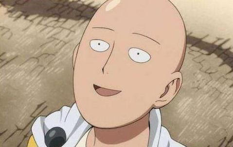
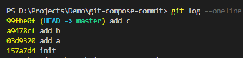
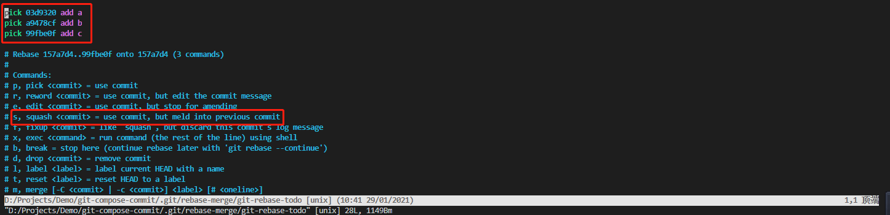
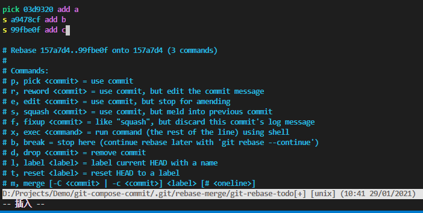
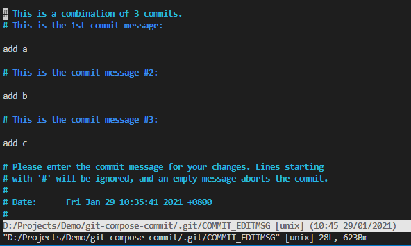
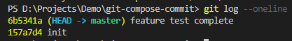

# 让我们一起玩玩rebase吧

## git rebase学习心路旅程

作为一个从来没用过git rebase的萌新，该如何学习，那答案肯定先是面向百度学习一波，在加上各种大佬的技术贴，不断吸收，成长，最终达到了学废了嘛，脑子应该是学废了，就是手还没学废，所以面对这样的困境，该如何去做？答案当然只有一个，就是自己敲一遍加深印象，感悟真理，如果一遍不行，那就第二遍，第三遍，...第n遍，直到像琦玉老师那样，我秃了（可以不秃就不秃吧），但也变强了~

检验自己是否学会，就看自己能否独立再把所学的知识码出来，最好能总结下文章，总之，实践出真知，会看足球比赛和会踢球是两码事，或者拿游戏举例子，看高玩各种秀操作，脑子看懂了学不废，手却学不废，这是为什么，就是练得少了，得加深印象，下面我们就开始本次练习的重点吧

## git rebase主要练习

* 美容术~让changelog变的更好看(本地的多次提交合并为一个~)
* 保持整个分支树的完美线性(改变基线, abcdef不香嘛，对比merge案例~)

## 本地的多次提交合并为一个

先来说说为什么要把多次提交合并成一个，前面说到changelog变好看(美容术)又是什么鬼，这里给大家举个简单的例子，比方说我们有个新功能，名字就叫**test**，然后这个功能又有很多细节，比如有a，b，c三个细节，开发者可能会完成一个细节就会提交一下，于是乎，这个功能最终完成后，就有a,b,c三个提交记录，但实际上我们就是为了完成这个**test**功能吧，changelog就是给用户看我们实际更新了改了什么，三个细节合并成一个“新功能test”不香嘛，于是乎美容术的存在就有了意义

开始搞起，先新建个项目，这里我取名为**git-compose-commit**，为了模拟场景，我们先做以下的操作
* `git init`初始化
* 新建一个**test.text**，提交一把`git add .`以及`git commit -m 'init'`
* 在**test.text**里写上个a保存下，继续提交`git add .`以及`git commit -m 'add a'`
* 在**test.text**里写上个b保存下，继续提交`git add .`以及`git commit -m 'add b'`
* 在**test.text**里写上个c保存下，继续提交`git add .`以及`git commit -m 'add c'`
* 此时我们就可以看看日志了，输入`git log --oneline`，来张截图给各位看官看下

    

* 假设我们的test功能就完成了，我现在就要搞美容术了把abc合并在一起，这里我们要记住下`add a`的**上次提交记录的id**，在这里就是`157a7d4`, 为什么要记住这个，是因为我们的指令`git rebase -i xxx`，这里的xxx指的就是提交id，这样就可以把init后的提交记录做合并处理，然后-i就是些交互指令，废话不多说我们直接走起，`git rebase -i 157a7d4`来看下交互指令

    

* 我们看到了提交记录abc，也看到了交互面板，其中s这里就已经说明了一切**use commit, but meld into previous commit**，使用commit，然后合并到上个commit，那我们只要把bc前面的pick指令改成s即可

* XMD（兄弟们）,按下i开始编辑吧

    

* 在这里已经看到我把bc前面的模式改成s了之后该做什么，当然是保存啦~esc后`:wq`加回车

    

* 因为是合并操作，所以我们可以写个总结的commit信息，对了#开头的都代表是注释，所以随意删，同样的操作`i`插入，写完commit消息后esc，然后`:wq`回车保存退出

* 此时在看下我们的`git log --oneline`

    

* 酷不酷想不想学，abc就变成了一条记录啦~XDM觉得美容术可以的话记得自己也要练一下哦~   

## 改变基线大法