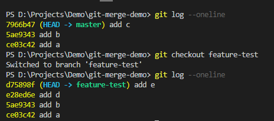

# 让我们一起玩玩rebase吧

## git rebase学习心路旅程

作为一个从来没用过git rebase的萌新，该如何学习，那答案肯定先是面向百度学习一波，在加上各种大佬的技术贴，不断吸收，成长，最终达到了学废了嘛，脑子应该是学废了，就是手还没学废，所以面对这样的困境，该如何去做？答案当然只有一个，就是自己敲一遍加深印象，感悟真理，如果一遍不行，那就第二遍，第三遍，...第n遍，直到像琦玉老师那样，我秃了（可以不秃就不秃吧），但也变强了

检验自己是否学会，就看自己能否独立再把所学的知识码出来，最好能总结下文章，总之，实践出真知，会看足球比赛和会踢球是两码事，或者拿游戏举例子，看高玩各种秀操作，脑子看懂了学不废，手却学不废，这是为什么，就是练得少了，得加深印象，下面我们就开始本次练习的重点吧

## git rebase主要练习

* 美容术，让changelog变的更好看(本地的多次提交合并为一个)
* 保持整个分支树的完美线性(改变基线, abcdef不香嘛，对比merge案例)

## 本地的多次提交合并为一个

### 合并的原因

先来说说为什么要把多次提交合并成一个，前面说到changelog变好看(美容术)又是什么鬼，这里给大家举个简单的例子，比方说我们有个新功能，名字就叫**test**，然后这个功能又有很多细节，比如有a，b，c三个细节，开发者可能会完成一个细节就会提交一下，于是乎，这个功能最终完成后，就有a,b,c三个提交记录，但实际上我们就是为了完成这个**test**功能吧，changelog就是给用户看我们实际更新了改了什么，三个细节合并成一个“新功能test”不香嘛，于是乎美容术的存在就有了意义

### 开始练习

开始搞起，先新建个项目，这里我取名为**git-compose-commit**，为了模拟场景，我们先做以下的操作
`git init`初始化
新建一个**test.text**，提交一把`git add .`以及`git commit -m 'init'`
在**test.text**里写上个a保存下，继续提交`git add .`以及`git commit -m 'add a'`
在**test.text**里写上个b保存下，继续提交`git add .`以及`git commit -m 'add b'`
在**test.text**里写上个c保存下，继续提交`git add .`以及`git commit -m 'add c'`
此时我们就可以看看日志了，输入`git log --oneline`，来张截图给各位看官看下

假设我们的test功能就完成了，我现在就要搞美容术了把abc合并在一起，这里我们要记住下`add a`的**上次提交记录的id**，在这里就是`157a7d4`, 为什么要记住这个，是因为我们的指令`git rebase -i xxx`，这里的xxx指的就是提交id，这样就可以把init后的提交记录做合并处理，然后-i就是些交互指令，废话不多说我们直接走起，`git rebase -i 157a7d4`来看下交互指令

我们看到了提交记录abc，也看到了交互面板，其中s这里就已经说明了一切**use commit, but meld into previous commit**，使用commit，然后合并到上个commit，那我们只要把bc前面的pick指令改成s即可

XMD（兄弟们）,按下i开始编辑吧

在这里已经看到我把bc前面的模式改成s了之后该做什么，当然是保存啦,esc后`:wq`加回车

在这之后又弹出了另外个交互界面，如上图所示，因为是合并操作，所以我们可以写个总结的commit信息，对了#开头的都代表是注释，所以随意删，同样的操作`i`插入，写完commit消息后esc，然后`:wq`回车保存退出

此时在看下我们的`git log --oneline`

酷不酷想不想学，abc就变成了一条记录**feature test complete**啦，XDM觉得美容术可以的话记得自己也要练一下哦   

### 需要注意的细节

如果有冲突的话，记得修改然后`git add .`和`git rebase --continue`

如果想放弃rebase的操作，直接`git rebase --abort`,回到rebase操作之前的状态，之前的提交的不会丢弃

## 改变基线大法

### 先来看看大佬怎么说

萌新猪(我)：要说rebase的优势是什么，这里就不得不提merge，要想对比出其中的区别，那必然是搞2个一样的环境， 用不一样的合并方式合并代码，才能看出区别，先来张大佬的图，不知道大家在面向百度，面向各种技术大佬的技术贴是否和我一样，看貌似都懂了，但不敲就是领悟不到奥义

该大佬是这么说的
> Git无疑现在已经成为最流行的代码管理工具之一。其中有两个命令，对很多程序员造成了很多的困惑，一个是merge，一个是rebase。
这些困惑主要纠结于到底应该用merge还是用rebase。
在继续深入探讨之前，我先抛出我的观点。如果你想拥有一套稳定的，健壮的代码, 永远要使用rebase。
不为别的，就为了rebase可以给你提供一套清晰的代码历史。
相反的, merge会给你一套乱七八糟的代码历史。当你看到这样的代码历史的时候，我相信你绝对没有心情去研究每一个历史对应的代码。

### 我们开始搭初始环境吧（注意分别演示merge和rebase，初始环境一致）

环境大致是这样的，master分支commit这么2条记录a和b，此时基于master分支拉个feature分支，feature此时的记录应该和master一致也是a和b，(这不是废话吗，我们就是基于master开的分支)，然后我们在feature提交2个记录d和e，那此刻的feature的分支应该就是a，b，d，e(猪猪萌新,求你别再说废话了，那不行我还是要在说一会的),这个时候我们就要模拟个场景了，我们切回master分支，在提交个记录c，此刻的master分支就应该是a,b,c(虽然是废话，但还是想给大家捋清楚)，那么现在我们的master分支和feature分支应该分别是这样的

- master - a,b,c
- feature - a,b,d,e

再来张图给大家看看，这就是我们的初始环境，为了演示清楚，我这边分别建了个2个项目，一个是`git-merge-demo`，一个是`git-rebase-demo`，XDM，这2个项目的初始环境就和上述保持一致哦！

这里注意了，时间顺序，我们是先在feature上添加了d和e的记录，然后在master上在加了c的记录，在来张初始环境图给大家加深印象

### merge项目 -> merge开始

`git merge xxx`是什么意思，大家都知道，不就是把xxx合并到当前分支嘛，所以我们这边切回master分支`git checkout master`，在执行` git merge feature-test`（feature-test分支合进master分支）, 这样就把我们feature的内容合并进master了，此时我们在看下log, `git log --oneline`

我们不仅发现提交记录按照实际的时间排序(abdec)，而且还多了条merge的提交记录我们先把这个称为f记录吧，所以merge后的两个分支的记录分别是

- master - abdecf （f就是多出来的merge的那条记录，而且不成线性，看的难受）
- feature-test - abde

对了，同样要注意细节，如果有冲突，参考之前的**需要注意的细节**
分析到这里，xdm，流程图应该也可以自己整理了吧，接下来我们说说rebase（同样的套路，分析完，让xdm动手自己画图巩固学习！）

### rebase项目 -> rebase开始

和merge项目一样，初始的环境还是一样的搭
现在的场景相当于，我们在feature一直开发，已经开发了d和e的功能，但master其实也往前进了，更新了c功能，此时我们就可以检出 feature-test 分支，然后将它变基到 master 分支，记住我们是在feature分支，输入rebase指令`git rebase master`，进行变基操作

这里先讲下原理，它的原理是首先找到这两个分支（即当前分支 feature-test、变基操作的目标基底分支 master） 的最近共同祖先 b（我们不是master在**add a**和**add b**之后拉了feature分支嘛，那b就是我们的最近共同祖先），然后对比当前分支相对于该祖先的历次提交，提取相应的修改并存为临时文件（d，e就变成了临时文件，d'和e'就是快照）， 然后将当前分支指向目标基底 c（master后续不是前进有个c提交的记录嘛）, 最后以此将之前另存为临时文件的修改依序应用。（d'和e'就到了c后面，于是最终就是abcde了）
然后我们看到的结果就是这样 

我勒个去，果然可以啊，feature的提交记录就变成了abcde了，可以的
再然后我们就切回master，在执行合并操作，把feature-test合进master

此时我们的最终记录就是这样的

- master - abcde (没有f而且线性abcde真香)
- feature-test - abcde

对了，同样要注意细节，如果有冲突，参考之前的**需要注意的细节**
分析到这里，xdm，流程图应该也可以自己整理了吧！

## 参考文献

* [git merge和git rebase的区别, 切记：永远用rebase](https://zhuanlan.zhihu.com/p/75499871)
* [Git-分支-变基](https://git-scm.com/book/zh/v2/Git-%E5%88%86%E6%94%AF-%E5%8F%98%E5%9F%BA)

